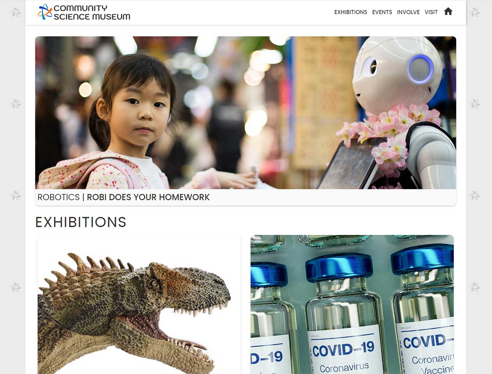
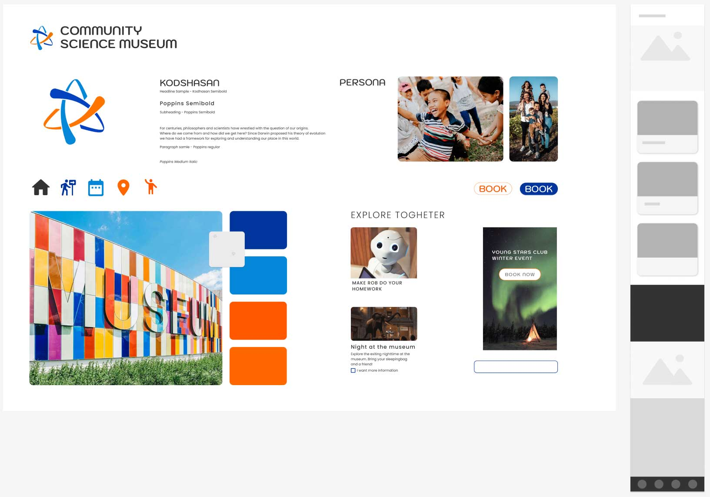
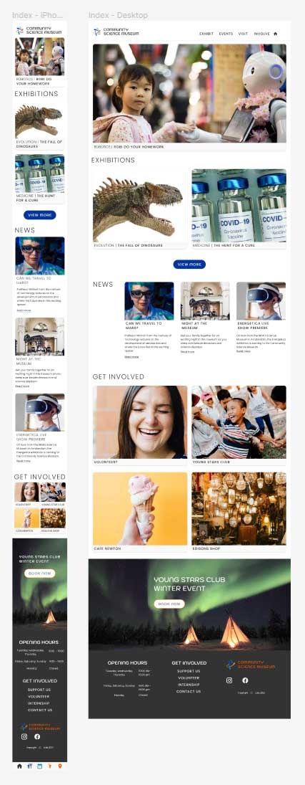
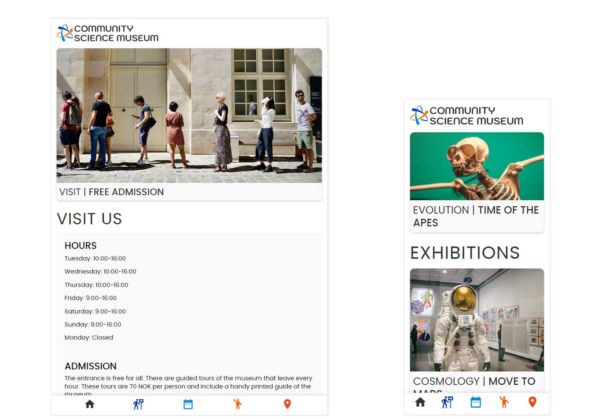

# The Community Science Museum

The Community Science Museum is an upcoming (but fictive), interactive museum that aims to educate and inspire primary and middle school children, as well as families.

## Noroff Frontend development - Semesterproject 1 / Grade: A

## What was the brief?

In this course assignment, we were given the task of developing The Community Science Museum, an interactive museum witch target audience is primary and middle school children (ages 7-15) and families with young children. The museum wanted an informative, appealing website to attract middle school pupils and their parents. The website should appeal to youngsters without pandering; it should take for granted that the audience is curious and intelligent. The website should be informative and engaging, encouraging viewers to visit the museum. The website should be responsive and easy to use on various devices.

There were several requirements to be met - from project methodology, research, analysis, design and prototyping of the project, to developing it in HTML and CSS, testing, debugging and deploying.

## What was my experience and what to do next time?

Throughout the process, I felt mastery as many times as I felt lost. It was a really long rollercoaster. I had some contrast issues along the way, especially with the orange colors, not complied with the WCAG standard. Figuring out when to use grid and flexbox, and how to write my nav, was also challenging - when at the same time already thinking about this in earlier stages of prototyping.

Although much seemed overwhelming at first, I was extremely happy for Trello and GitHub. The tools gave me the calm I needed and gave me a good overview of the projects process right from the start. It surprised me, that the first thing I felt doing was to “set the stage” for the project, by initializing files and folders, setting up the repository on GitHub and deploy to Netlify. I will for sure continue doing this, in my coming assignments.

I loved the whole process, with all the different stages. It gave me a lot of variation in the day to day workflow. What I am most proud of, are the mobile navigation and logo. I am also proud of how I handled the coding, which I have been insecure.

It was a challenge getting here, but it was worth all the effort! And i loved it!

## How I got there

- HTML
- CSS
- Trello for planning
- Adobe Photoshop
- Adobe Color
- Figma
- VS Code
- GitHub
- Netlify

## What helped me achieve this?

- Chrome Devtools and https://developer.mozilla.org/
- https://www.w3schools.com/
- LinkedIn Learning

Typography, icons and images:

- Google fonts and Icons: https://fonts.google.com/
- https://www.fontsquirrel.com/
- https://www.unsplash.com

Testing and debug:

- https://contrastchecker.com/
- https://validator.w3.org/
- https://wave.webaim.org/
- https://caniuse.com/

Other:

- https://mycolor.space/

## Who helped me when i felt blue

Kenneth Collins and Fredrik Rustad

## Do you want to take a look at my Community Science museum?

Netlify: https://community-sciencemuseumm.netlify.app/

## Some screen shots from the process

Screenshot of the style tile. Logo was designed by me, same goes for the background on widescreens. The logo spins 360 dgr on page loading: 

 
 
Screenshot of the project in Figma: 

 
 
Screenshot from iPad and iPhone view:

## Taking a closer look and run the repo?

Clone the repo and install with npm install command in you editors terminal. Run the app by npm run start.

# Contact
linda@digitaldesigner.no - let's work togheter!

